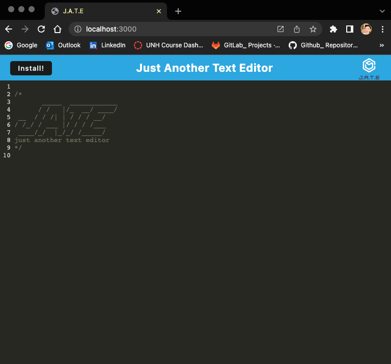
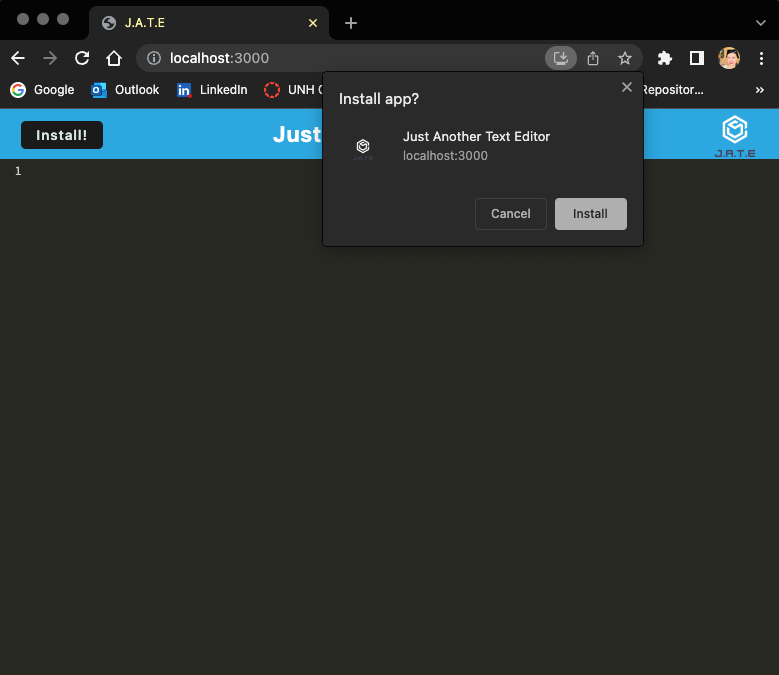
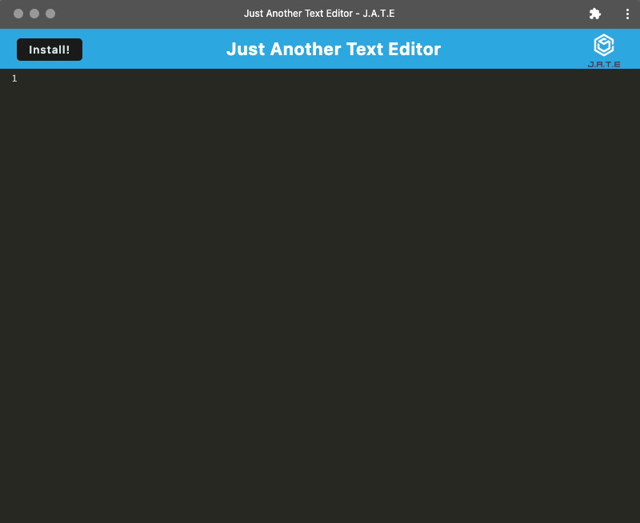

# PWA-Just-Another-Text-Editor

## License and Badges:

 

 
 

---

## Table of Contents:

- [License and Badges](#license-and-badges)
- [Purpose](#purpose)
- [Installation](#installation)
- [Screenshots](#screenshots)
- [Deployed URL](#deployed-url)
- [Questions](#questions)

---

## Purpose:

To create this simply offline application called `JATE- Just Another Text Editor` by following `Progressive Web Application` framework and utilizing `Webpack`, `Workbox`, and `indexDB` to store the data in the browser, and it can be used to a full functionality without internet connection. This application can be downloaded for your offline access.

---

## Installation:

To use this JATE Application. Please refer the following steps.

1. You can open `https://joyce-text-editor.herokuapp.com/` in your browser and an install button will appear on the top left of the screen.

2. You can also clone this package in your computer, and open in VS Code.
* You need to follow the steps below to start/ finish the process before installation.

* <h3>"scripts"</h3>: {

    1. **"start:dev"**: `"concurrently \"cd server && npm run server\" \"cd client && npm run dev\"",`

    2. **"start"**: "npm run build && cd server && node server.js",
    3. **"server"**: `"cd server nodemon server.js --ignore client",`
    
    4. **"build"**: `"cd client && npm run build",`

    5. **"install"**: `"cd server && npm i && cd ../client && npm i",`
    
    6. **"client"** : `"cd client && npm start"`
    
    }`

3. Lastly, you can easily deploy this application on Heroku. 

---

## Screenshots:

 

**Localhost 3000**

 

**Localhost 3000- Window of Asking Installing**

 

 

**APP Installed on Desktop**

 

**APP Has Installed Shown in the Finder on Mac** 

 

 

**Heroku Deployed Page** 

 

---

## Deployed URL:

- [Github Repository](https://github.com/Joyce750526/PWA-Just-Another-Text-Editor)

- [Deployed Heroku URL](https://joyce-text-editor.herokuapp.com/)

---

## Questions:

If you have any questions about this projects, please contact me!

- [Email Me](mailto:joyceideas@outlook.com)
- [Github](https://github.com/joyce750526)

---

Chao-Ying (Joyce) Chen

